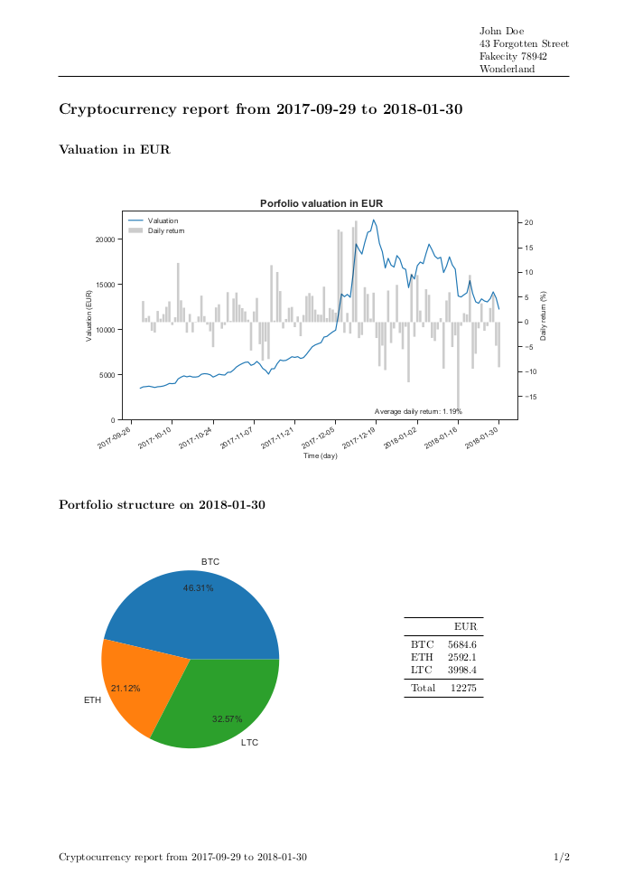

# Cryptoledger

Cryptoledger is a tool to keep track of cryptocurrency transactions

* Imports *.csv transaction lists exported from exchanges (bittrex and gdax supported) and consolidates them in a standardize *.csv file without duplicates.
* Calculate a portfolio on any given dates using the transaction list
* Estimate its value in specified currency using cryptocompare API
* Plot a portfolio pie chart, daily valuation and daily return for a given period
* Create a corresponding PDF report formatted with a Latex template

## Prerequisites

- A working Latex distribution with pdflatex must be installed to compile the final pdf report
- This program was tested on linux, using python 3.6.3. Other operating systems might require changes

## Installation
Install from github

    pip3 install git+https://github.com/rfortiz/cryptoledger

To import in other python scripts

    from cryptoledger import cryptoledger

## Command Line Usage

    python3 -m cryptoledger.cryptoledger ledger_db --export

Loads a ledger database (*.csv) and export a pdf report in the same folder

### *.csv Ledger Format

All imported transactions are consolidate in a user specified *.csv file. A new file is created if it doesn't exist. Regardless of the source used for import, all transactions are saved in a csv file with the following format:

UID|Base currency|Quote currency|Action|Quantity (#base)|Rate (Quote currency)|Amount (Quote currency)|Commission (Quote currency)|Timestamp|Exchange
-|-|-|-|-|-|-|-|-|-
transaction_id|ETH|BTC|BTC|BUY|3|0.03133112|0.09399336|0.000783278|1512651720|bittrex

1. **UID** transaction identification number used on exchange or blockchain for transfers (DEPOSIT|WITHDRAW)
2. **Base currency** symbol of the base currency
3. **Quote currency** symbol of the quote currency (equal to Base currency for transfers)
4. **Action** one of four actions: BUY|SELL|DEPOSIT|WITHDRAW
5. **Quantity** quantity of the base currency
6. **Rate** exchange rate (equal 1.0 for transfers)
7. **Amount** = Quantity * Rate, does not include commission
8. **Commission** fees from exchange or on chain transaction
9. **Timestamp** unix timestamp of the transaction closing date
10. **Exchange** name of the exchange in small caps

### Adding Transactions

    python3 -m cryptoledger.cryptoledger ledger_db --add csvs_folder_path

imports all *.csv files in csvs_folder_path folder. Filnames must follow:
** exchangeName_*.csv **, where exchange name is 'bittrex', 'gdax' or 'native' to import another database following the format above.

to get *.csv files from exchanges:

* **bittrex:** Orders &rightarrow; scroll down to 'Completed' &rightarrow; Load all (do not click 'csv')
* **gdax: ** Fills &rightarrow; select currency pair &rightarrow; Download Receipt/Statement

### Manual Input

    python3 -m cryptoledger.cryptoledger ledger_db --manual

Transactions can be added manually from command prompt with the argument -m. This can be used to add withdrawals or deposits that are not exported by the exchanges. Alternatively, a csv file named native_*.csv following the format above can be manually generated and imported using the -add argument

### Generating PDF report

    python3 -m cryptoledger.cryptoledger ledger_db --export

generates a pdf report in EUR from the date of the first transaction to the current date. The valuation currency can be changed with --currency:

    python3 -m cryptoledger.cryptoledger ledger_db --export --currency USD

and dates can be selected with --start_date/--end_date

    python3 -m cryptoledger.cryptoledger ledger_db --export --start_date 2017-12-01 --end_date 2017-12-31

-start/end dates
-currency
-files generated in same folder as ledger

### Example
This [report example](docs/report.pdf) can be reproduced with the dummy *.csv files provided in ./bin/csv_import. Assuming csv_import folder is in the working path:

    cd [working path where generated files will be stored]
    python3 -m cryptoledger.cryptoledger ledger.csv --add ./csv_import --export

## Built With

* [Pandas](https://pandas.pydata.org/) - Datastructures used to handle the protfolio
* [Matplotlib](https://matplotlib.org) - To create the plots
* [Cryptocompare API](https://www.cryptocompare.com/api/) - historical cryptocurrency data
* [Jinja2](http://jinja.pocoo.org/docs/2.10/) - Templating engine used to parse Latex file and insert python variables
*  [LaTeX](https://www.latex-project.org/) - Document preparation system used to creat PDFs

## Possible Improvements

This project was undertaken to learn python programming and several aspects could be improved:

* The ledger (transactions list) is handled by a custom class using python built-in functions. Using Pandas dataframe would be simpler and more efficient.
* More error handling (user inputs, invalid transactions, api offline, etc.)
* Test other operating systems, python version, etc.
* Avoid recalculating the portfolio from ledger every time (not a problem for small database, time consuming currency conversion using cryptocompare API is saved and reused until new transactions are added)
* Daily portfolio DataFrame contains lots of duplicates and could be replaced by Pandas' sparse data structures
* Tracking unmatched transactions

## License

This project is licensed under the MIT License - see the [LICENSE.md](LICENSE.md) file for details

